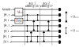

# UTBEQuantumWalk
Ultrafast time-bin encoding (UTBE) quantum walk simulation using Strawberryfields (https://strawberryfields.readthedocs.io/).

For details, see: K. Fenwick et al. https://arxiv.org/abs/2404.02238

Requires packages numpy and strawberryfields.

## How it works

The UTBE quantum walk being simulated is a sequence of alpha-BBO crystals whose orientation alternates between 0 degrees and 45 degrees with respect to the horizontal/vertical (H/V) basis. These enact the following transformations:

|H, t_n> -> aBBO (0 deg) -> |H, t_n>  
|V, t_n> -> aBBO (0 deg) -> |V, t_{n+1}>  
|D, t_n> -> aBBO (45 deg) -> |D, t_n>  
|A, t_n> -> aBBO (45 deg) -> |A, t_{n+1}>  

where |D>=(|H>+|V>)/sqrt(2) and |A>=(-|H>+|V>)/sqrt(2).

The code implements these dynamics into a quantum circuit which can simulated in Strawberryfields. As an example, consider a 2-step quantum walk:

The input state is a two-mode squeezed vacuum state in modes 0 and 1, and a coherent state in the mode 2. Mode 0 is a the heralding mode and does not participate in the walk. The transformation U_BS is a 50:50 beam splitter while U_SWAP is a SWAP operation (i.e. a beam splitter with unit reflectivity). To ensure light does not propagate backwards in time, the SWAP operations are applied on the later time bins first.

The code can take into account various experimental imperfections, including dark counts (i.e. noise photons), mode matching, and optical losses. It is also straightforward to model click detectors by replacing `fock_prob` with `threshold_detection_prob` where the latter is implemented using TheWalrus (https://the-walrus.readthedocs.io).
